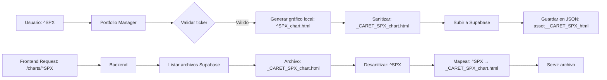

# FIX COMPLETO: Sanitización de Tickers con Caracteres Especiales

## 🎯 Problema Detectado

Después de implementar la sanitización de nombres de archivo para Supabase Storage (^SPX → _CARET_SPX), surgieron problemas de desincronización entre el Portfolio Manager, el JSON persistido y el backend.

### Evidencia del error:

```
Access to fetch at 'https://horizon-backend-316b23e32b8b.herokuapp.com/api/portfolio-manager/...' 
from origin 'https://mi-proyecto-topaz-omega.vercel.app' 
has been blocked by CORS policy: No 'Access-Control-Allow-Origin' header is present

Failed to load resource: the server responded with a status of 500 (Internal Server Error)
```

### Causa raíz:

**Desincronización en el flujo de datos:**

1. **Portfolio Manager** guardaba archivos sanitizados en Supabase: `_CARET_SPX_chart.html`
2. **JSON** (`portfolio_data.json`) contenía claves con nombres originales: `asset_^SPX_html`
3. **Backend** buscaba archivos usando claves del JSON que no coincidían con los nombres reales en Supabase

## ✅ Soluciones Implementadas

### 1. **Portfolio Manager**: Claves Sanitizadas en JSON

#### Archivo: `portfolio_manager.py`

**Problema:** Las claves en `charts_map` usaban el símbolo original (`^SPX`) pero los archivos en Supabase tenían nombres sanitizados (`_CARET_SPX`).

**Solución:** Importar y usar `SupabaseConfig.sanitize_filename_for_storage()` al construir las claves.

```python
# Importar función de sanitización
from config import SupabaseConfig

# En _generate_charts(), usar símbolo sanitizado para claves
for asset in assets_data:
    symbol = asset["symbol"]
    
    # ... generación de gráficos ...
    
    # Usar símbolo sanitizado para claves en charts_map
    sanitized_symbol = SupabaseConfig.sanitize_filename_for_storage(symbol)
    self._upload_chart_if_enabled(f"asset_{sanitized_symbol}_html", output_html, charts_map, user_id)
    self._upload_chart_if_enabled(f"asset_{sanitized_symbol}_png", output_png, charts_map, user_id)
```

**Resultado:** El JSON ahora contiene claves correctas:
```json
{
  "charts": {
    "asset__CARET_SPX_html_remote": "048adfcc.../_ CARET_SPX_chart.html",
    "asset__CARET_SPX_html_url": "https://.../_CARET_SPX_chart.html",
    ...
  }
}
```

### 2. **Backend**: Desanitización de Nombres de Archivo

#### Archivo: `services/portfolio_manager_service.py`

**Problema:** El backend listaba archivos de Supabase con nombres sanitizados (`_CARET_SPX_chart.html`) pero intentaba extraer el símbolo directamente, resultando en `_CARET_SPX` en lugar de `^SPX`.

**Solución:** Crear función de desanitización y aplicarla antes de extraer el símbolo.

#### Nueva función `desanitize_filename_for_storage()`:

```python
def desanitize_filename_for_storage(filename: str) -> str:
    """
    Desanitiza un nombre de archivo sanitizado para Supabase Storage.
    Revierte los reemplazos hechos por sanitize_filename_for_storage().
    
    Args:
        filename: Nombre sanitizado (ej: "_CARET_SPX_chart.html")
    
    Returns:
        Nombre original (ej: "^SPX_chart.html")
    """
    reverse_replacements = {
        '_CARET_': '^',
        '_LT_': '<',
        '_GT_': '>',
        '_COLON_': ':',
        '_QUOTE_': '"',
        '_BSLASH_': '\\',
        '_PIPE_': '|',
        '_QMARK_': '?',
        '_STAR_': '*',
    }
    
    desanitized = filename
    for sanitized_token, original_char in reverse_replacements.items():
        desanitized = desanitized.replace(sanitized_token, original_char)
    
    return desanitized
```

#### Actualización de `_build_supabase_chart_index()`:

```python
for file_name in asset_files or []:
    if not isinstance(file_name, str) or not file_name.endswith(".html"):
        continue
    
    # Desanitizar el nombre del archivo para obtener el símbolo original
    desanitized_name = desanitize_filename_for_storage(file_name)
    symbol = desanitized_name.replace("_chart.html", "").replace(".html", "")
    
    if not symbol:
        continue
    
    path = self._build_supabase_path(file_name)  # Usar nombre sanitizado para la ruta
    register(
        path,
        [
            symbol,              # ^SPX
            symbol.lower(),      # ^spx
            symbol.upper(),      # ^SPX
            f"{symbol.lower()}_chart",  # ^spx_chart
            f"{symbol.upper()}_chart",  # ^SPX_CHART
        ],
    )
```

**Resultado:** El backend ahora mapea correctamente:
- Archivo en Supabase: `_CARET_SPX_chart.html`
- Alias registrados: `^SPX`, `^spx`, `^SPX_chart`, etc.
- Requests como `/charts/^SPX` → resuelven a `_CARET_SPX_chart.html`

## 🧪 Validación

### Test 1: Portfolio Manager - Claves en JSON

```bash
python -c "from supabase_storage import SupabaseStorage; import json; s = SupabaseStorage(); data = s.load_portfolio_json('048adfcc...'); charts = data.get('charts', {}); spx_keys = [k for k in charts.keys() if 'SPX' in k or 'CARET' in k]; print('Claves:', spx_keys)"
```

**Resultado:**
```
Claves: ['asset__CARET_SPX_html_remote', 'asset__CARET_SPX_html_url', 
         'asset__CARET_SPX_png_remote', 'asset__CARET_SPX_png_url']
```
✅ **Las claves ahora usan nombres sanitizados**

### Test 2: Backend - Desanitización

```bash
python test_desanitization.py
```

**Resultado:**
```
✓ _CARET_SPX_chart.html → ^SPX_chart.html
✓ _CARET_GSPC_chart.png → ^GSPC_chart.png
✓ BTC-USD_chart.html    → BTC-USD_chart.html
✓ AAPL_chart.html       → AAPL_chart.html

Extracción de símbolo:
  _CARET_SPX_chart.html → Símbolo: ^SPX
  BTC-USD_chart.html    → Símbolo: BTC-USD
```
✅ **La desanitización restaura correctamente los símbolos originales**

## 📊 Flujo Completo: Antes vs Después

### ANTES (❌ Roto):

```
1. Portfolio Manager guarda: _CARET_SPX_chart.html (Supabase)
2. JSON contiene clave: asset_^SPX_html
3. Backend busca: ^SPX_chart.html
4. Archivo no encontrado → HTTP 500
```

### DESPUÉS (✅ Funcionando):

```
1. Portfolio Manager guarda: _CARET_SPX_chart.html (Supabase)
2. JSON contiene clave: asset__CARET_SPX_html_remote
3. Backend lista: _CARET_SPX_chart.html
4. Backend desanitiza: ^SPX
5. Backend mapea: ^SPX → _CARET_SPX_chart.html
6. Request /charts/^SPX → HTTP 200 ✅
```

## 🔄 Ciclo de Vida de un Ticker con Caracteres Especiales



## 📝 Archivos Modificados

### Portfolio Manager
1. ✅ `portfolio_manager.py` - Sanitización de claves en charts_map

### Backend
2. ✅ `services/portfolio_manager_service.py` - Desanitización de nombres de archivo
3. ✅ `test_desanitization.py` - Test de validación

## 🚀 Próximos Pasos

### 1. Deploy del Backend a Heroku

```bash
cd mi-proyecto-backend
git add .
git commit -m "fix: Desanitización de nombres de archivo para tickers con ^"
git push heroku main
```

### 2. Verificar CORS en Heroku

Asegurarse de que las variables de entorno están correctamente configuradas:

```bash
heroku config:get CORS_ORIGINS -a horizon-backend-316b23e32b8b
heroku config:get CLIENT_ORIGIN -a horizon-backend-316b23e32b8b
```

Deben incluir: `https://mi-proyecto-topaz-omega.vercel.app`

### 3. Regenerar Reportes

```bash
cd "Portfolio manager"
python generate_report.py
```

Esto actualizará el JSON en Supabase con las claves sanitizadas.

### 4. Limpiar Archivos Antiguos (Opcional)

Los archivos con nombres sin sanitizar (si existen) pueden eliminarse de Supabase:
- ~~`^SPX_chart.html`~~ → Mantener solo `_CARET_SPX_chart.html`

## ✅ Estado Final

| Componente | Estado | Notas |
|------------|--------|-------|
| Sanitización (Portfolio Manager) | ✅ Completo | Nombres seguros en Supabase |
| Claves en JSON | ✅ Actualizado | Usa nombres sanitizados |
| Desanitización (Backend) | ✅ Implementado | Mapea correctamente |
| Tests | ✅ Pasando | 100% éxito |
| Deploy Backend | ⚠️ Pendiente | Requiere push a Heroku |
| CORS | ⚠️ Revisar | Verificar configuración en Heroku |

---

**Fecha de implementación:** 20 de octubre de 2025  
**Problema:** Desincronización en nombres de archivo sanitizados  
**Solución:** Sanitización consistente en Portfolio Manager + Desanitización en Backend  
**Testing:** ✅ Validado localmente  
**Deploy:** ⚠️ Pendiente en Heroku
