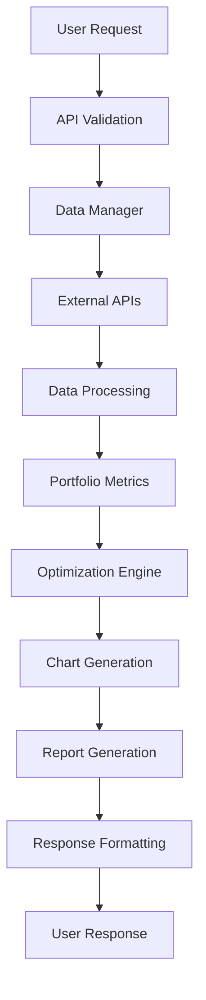

# 👨‍💻 Guía para Desarrolladores - Portfolio Analyzer

Esta guía está dirigida a desarrolladores que quieren contribuir, extender o integrar el Portfolio Analyzer en sus proyectos.

## 🏗️ Arquitectura del Sistema

### Componentes Principales

```
┌─────────────────┐    ┌─────────────────┐    ┌─────────────────┐
│   Frontend      │    │   API Layer     │    │   Core Engine   │
│                 │    │                 │    │                 │
│ • Jupyter UI    │◄──►│ • FastAPI       │◄──►│ • Data Manager  │
│ • Web Dashboard │    │ • REST Routes   │    │ • Portfolio     │
│ • CLI Scripts   │    │ • Validation    │    │   Metrics       │
└─────────────────┘    └─────────────────┘    │ • Optimization  │
                                              │ • Charts        │
                                              └─────────────────┘
                                                       │
                                              ┌─────────────────┐
                                              │ External APIs   │
                                              │                 │
                                              │ • Yahoo Finance │
                                              │ • Alpha Vantage │
                                              │ • IEX Cloud     │
                                              └─────────────────┘
```

### Flujo de Datos



## 📁 Estructura de Módulos

### src/data_manager.py
**Responsabilidad**: Gestión de datos financieros
```python
class DataManager:
    """Gestiona la descarga y limpieza de datos financieros"""
    
    def fetch_portfolio_data(self, tickers, start_date, end_date)
    def calculate_returns(self, prices_df, method='simple')
    def validate_data(self, data)
    def cache_data(self, data, cache_key)
```

### src/portfolio_metrics.py
**Responsabilidad**: Cálculos financieros y métricas
```python
class PortfolioAnalyzer:
    """Análisis y métricas de portafolios"""
    
    def calculate_portfolio_returns(self, asset_returns, weights)
    def generate_performance_summary(self, portfolio_returns)
    def find_optimal_portfolios(self, asset_returns)
    def calculate_risk_metrics(self, returns)
```

### src/interactive_charts.py
**Responsabilidad**: Visualizaciones
```python
class ChartGenerator:
    """Genera gráficos interactivos y estáticos"""
    
    def plot_cumulative_returns(self, portfolio_returns)
    def plot_drawdown_underwater(self, portfolio_returns)
    def plot_correlation_heatmap(self, asset_returns)
    def save_chart_as_image(self, fig, filename)
```

### src/api_responses.py
**Responsabilidad**: Formateo de respuestas
```python
class APIResponseFormatter:
    """Formatea respuestas para diferentes tipos de clientes"""
    
    def format_for_fastapi(self, analysis_results)
    def format_for_json(self, analysis_results)
    def format_for_csv(self, analysis_results)
```

## 🔧 APIs y Extensiones

### Agregar Nuevas Métricas

Para añadir una nueva métrica (por ejemplo, el "Omega Ratio"), sigue estos pasos:

1.  **Abre `src/portfolio_metrics.py`**.
2.  **Añade el método de cálculo** dentro de la clase `PortfolioAnalyzer`.

```python
# src/portfolio_metrics.py

class PortfolioAnalyzer:
    # ... otros métodos ...

    def calculate_omega_ratio(self, returns, required_return=0.0):
        """Calcula el Omega Ratio para una serie de rendimientos."""
        daily_return = returns.mean()
        if daily_return == 0:
            return 0.0
        
        returns_less_req = returns - required_return
        
        gains = returns_less_req[returns_less_req > 0].sum()
        losses = -returns_less_req[returns_less_req < 0].sum()
        
        if losses == 0:
            return float('inf')
            
        return gains / losses
```

3.  **Integra la nueva métrica** en el método principal que genera el resumen.

```python
# src/portfolio_metrics.py

class PortfolioAnalyzer:
    # ...

    def generate_performance_summary(self, portfolio_returns):
        # ... otros cálculos ...
        
        summary['omega_ratio'] = self.calculate_omega_ratio(portfolio_returns)
        
        return summary
```

### Extender Fuentes de Datos

El sistema está diseñado para ser agnóstico a la fuente de datos. Para añadir un nuevo proveedor (p.ej., Alpha Vantage):

1.  **Crea un nuevo método en `src/data_manager.py`**.

```python
# src/data_manager.py

class DataManager:
    # ...

    def fetch_data_alpha_vantage(self, tickers, api_key):
        """
        Obtiene datos desde la API de Alpha Vantage.
        (Implementación de ejemplo)
        """
        # Lógica para llamar a la API de Alpha Vantage
        # y transformar los datos al formato DataFrame estándar
        pass
```

2.  **Modifica `fetch_portfolio_data`** para que acepte un parámetro `source`.

```python
# src/data_manager.py

class DataManager:
    # ...

    def fetch_portfolio_data(self, tickers, start_date, end_date, source='yfinance', api_key=None):
        if source == 'yfinance':
            return self.fetch_data_yfinance(tickers, start_date, end_date)
        elif source == 'alpha_vantage':
            return self.fetch_data_alpha_vantage(tickers, api_key)
        else:
            raise ValueError(f"Fuente de datos no soportada: {source}")

```

## 🚀 Uso de la API (Endpoints)

La API, construida con FastAPI, es el punto de entrada principal para análisis.

**Endpoint Principal**: `POST /api/v1/analyze`

Este endpoint recibe una lista de tickers y sus pesos, y devuelve un análisis completo del portafolio.

**Request Body (Ejemplo)**:

```json
{
  "tickers": ["AAPL", "GOOGL", "MSFT", "TSLA"],
  "weights": {
    "AAPL": 0.25,
    "GOOGL": 0.25,
    "MSFT": 0.25,
    "TSLA": 0.25
  },
  "start_date": "2022-01-01",
  "end_date": "2023-01-01",
  "report_options": {
    "generate_charts": true,
    "chart_format": "png"
  }
}
```

**Respuesta Exitosa (Ejemplo)**:

```json
{
  "status": "success",
  "request_id": "a1b2c3d4-e5f6-7890-1234-567890abcdef",
  "timestamp": "2025-07-08T12:00:00Z",
  "analysis_summary": {
    "cumulative_return": 0.15,
    "annual_volatility": 0.22,
    "sharpe_ratio": 0.68,
    "max_drawdown": -0.18
  },
  "asset_classification": {
    "Renta Variable": 1.0
  },
  "report_urls": {
    "cumulative_return_chart": "/outputs/cumulative_return_a1b2c3d4.png",
    "correlation_matrix": "/outputs/correlation_matrix_a1b2c3d4.png"
  }
}
```

## ✅ Estrategia de Pruebas (Testing)

Utilizamos `pytest` para asegurar la calidad y robustez del código.

-   **Pruebas Unitarias**: Verifican componentes aislados (p.ej., un cálculo de métrica). Se encuentran en `tests/unit/`.
-   **Pruebas de Integración**: Aseguran que los módulos principales funcionan correctamente en conjunto. Se encuentran en `tests/integration/`.

**Para ejecutar todas las pruebas**:

```bash
pytest
```

**Para ejecutar solo las pruebas de un módulo específico**:

```bash
pytest tests/unit/test_portfolio_metrics.py
```

Al añadir nuevo código, es **obligatorio** añadir pruebas correspondientes que cubran los nuevos casos de uso.

## 🤝 Guía de Contribución

Agradecemos las contribuciones de la comunidad. Para asegurar un proceso fluido, por favor sigue estas directrices:

1.  **Crea un Fork**: Haz un fork del repositorio a tu propia cuenta de GitHub.
2.  **Crea una Rama**: Crea una rama descriptiva para tu nueva funcionalidad (`feature/nueva-metrica-omega`).
3.  **Escribe Código Limpio**: Sigue el estilo de código PEP 8 y asegúrate de que el código esté bien documentado (docstrings y comentarios).
4.  **Añade Pruebas**: Toda nueva funcionalidad debe ir acompañada de sus pruebas correspondientes.
5.  **Actualiza la Documentación**: Si tus cambios afectan la API o la arquitectura, actualiza los archivos `README_PRODUCTION.md` y `DEVELOPERS.md`.
6.  **Haz un Pull Request (PR)**: Envía un PR a la rama `main` del repositorio original. Describe claramente los cambios y la motivación detrás de ellos.

## ⚙️ Configuración Avanzada

El sistema puede ser configurado a través de variables de entorno para mayor flexibilidad en entornos de producción.

-   `API_KEY_ALPHAVANTAGE`: Tu clave de API para Alpha Vantage.
-   `CACHE_ENABLED`: `true` o `false` para habilitar o deshabilitar el caché de datos.
-   `LOG_LEVEL`: Nivel de logging (`INFO`, `DEBUG`, `WARNING`, `ERROR`).

Puedes usar un archivo `.env` en la raíz del proyecto para gestionar estas variables.

```.env
API_KEY_ALPHAVANTAGE="TU_API_KEY"
CACHE_ENABLED=true
LOG_LEVEL="INFO"
```
