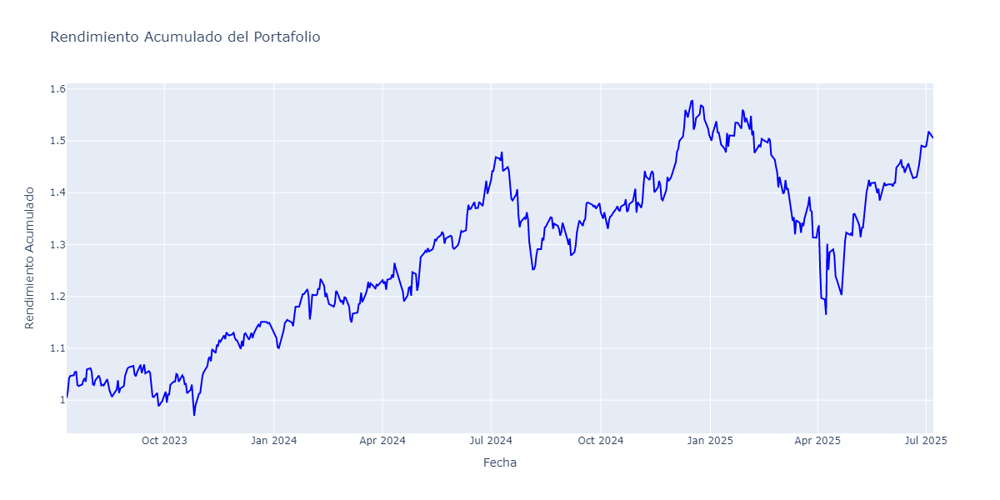
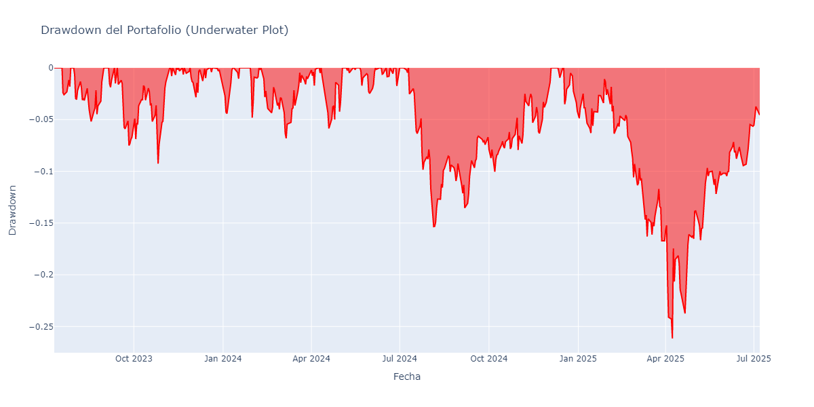
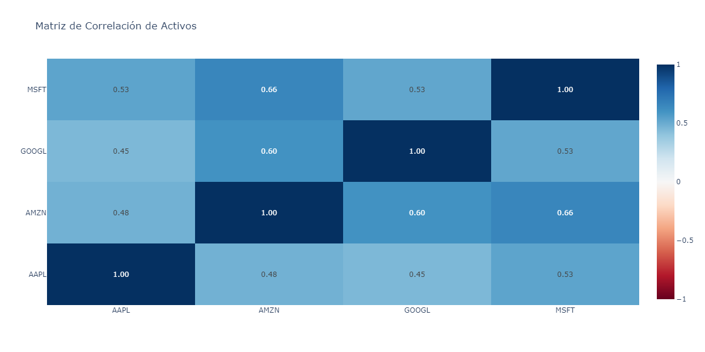

# Reporte de Análisis de Portafolio

**Fecha de generación:** 2025-07-08 14:59:33  
**Período analizado:** 2023-07-11 a 2025-07-07  
**Total de días:** 499

---

## 📊 Resumen Ejecutivo

### Composición del Portafolio
| Activo | Peso (%) |
|--------|----------|
| AAPL | 25.00% |
| GOOGL | 25.00% |
| MSFT | 25.00% |
| AMZN | 25.00% |

### 📈 Información Actual de Mercado
| Activo | Precio | Cambio ($) | Cambio (%) | Cap. Mercado | Sector |
|--------|--------|------------|------------|--------------|--------|
| AAPL | $210.04 | +$0.09 | +0.04% | $3.14T | Technology |
| GOOGL | $174.35 | -$2.44 | -1.38% | $2.12T | Communication Services |
| MSFT | $496.72 | -$1.00 | -0.20% | $3.69T | Technology |
| AMZN | Error | - | - | - | - |

### Métricas de Rendimiento Clave
| Métrica | Valor |
|---------|-------|
| Rendimiento Anualizado (%) | 15.23% |
| Volatilidad Anualizada (%) | 22.70% |
| Ratio de Sharpe | 0.94 |
| Ratio de Sortino | 1.37 |
| Ratio de Calmar | 0.58 |
| Máximo Drawdown (%) | -26.16% |
| Skewness (Asimetría) | 0.60 |
| Kurtosis (Curtosis) | 9.58 |
| Valor en Riesgo (VaR) Diario (%) | -2.26% |

---

## 🎯 Optimización de Portafolios

### Portafolio de Máximo Ratio de Sharpe
**Rendimiento Anualizado:** 27.67%  
**Volatilidad Anualizada:** 24.11%  
**Ratio de Sharpe:** 1.06

#### Composición Óptima (Máximo Sharpe)
| Activo | Peso Óptimo (%) |
|--------|-----------------|
| AAPL | 0.00% |
| AMZN | 42.83% |
| GOOGL | 8.27% |
| MSFT | 48.90% |

### Portafolio de Mínima Volatilidad
**Rendimiento Anualizado:** 19.23%  
**Volatilidad Anualizada:** 21.26%  
**Ratio de Sharpe:** 0.81

#### Composición Óptima (Mínima Volatilidad)
| Activo | Peso Óptimo (%) |
|--------|-----------------|
| AAPL | 25.48% |
| AMZN | 0.00% |
| GOOGL | 16.26% |
| MSFT | 58.26% |

---

## 📈 Análisis de Correlaciones

### Matriz de Correlación de Activos
| Activo | AAPL | AMZN | GOOGL | MSFT |
|--------|--------|--------|--------|--------|
| AAPL | 1.000 | 0.482 | 0.454 | 0.533 |
| AMZN | 0.482 | 1.000 | 0.605 | 0.658 |
| GOOGL | 0.454 | 0.605 | 1.000 | 0.525 |
| MSFT | 0.533 | 0.658 | 0.525 | 1.000 |

---

## 📊 Gráficos de Análisis

### Rendimiento Acumulado

### Análisis de Drawdown

### Matriz de Correlación (Heatmap)

---

## 🔍 Análisis Detallado

### Estadísticas de Riesgo
- **Valor en Riesgo (VaR) Diario:** -2.26%
- **Máximo Drawdown:** -26.16%
- **Skewness (Asimetría):** 0.60
- **Kurtosis (Curtosis):** 9.58

### Ratios de Rendimiento Ajustado por Riesgo
- **Ratio de Sharpe:** 0.94
- **Ratio de Sortino:** 1.37
- **Ratio de Calmar:** 0.58

---

## 💡 Conclusiones y Recomendaciones

### Análisis del Portafolio Actual
⚠️ **Rendimiento moderado** - El ratio de Sharpe sugiere un rendimiento aceptable, pero hay margen de mejora.

🚨 **Alto riesgo de pérdidas** - El máximo drawdown superior al 20% indica alta volatilidad y riesgo.

### Recomendaciones de Optimización
- **Para maximizar el ratio de Sharpe:** Considere ajustar los pesos según la composición óptima mostrada arriba.
- **Para minimizar riesgo:** La composición de mínima volatilidad puede ser más apropiada para perfiles conservadores.
- **Diversificación:** Analice las correlaciones para identificar oportunidades de mejor diversificación.

---

*Este reporte fue generado automáticamente el 2025-07-08 a las 14:59:35*
