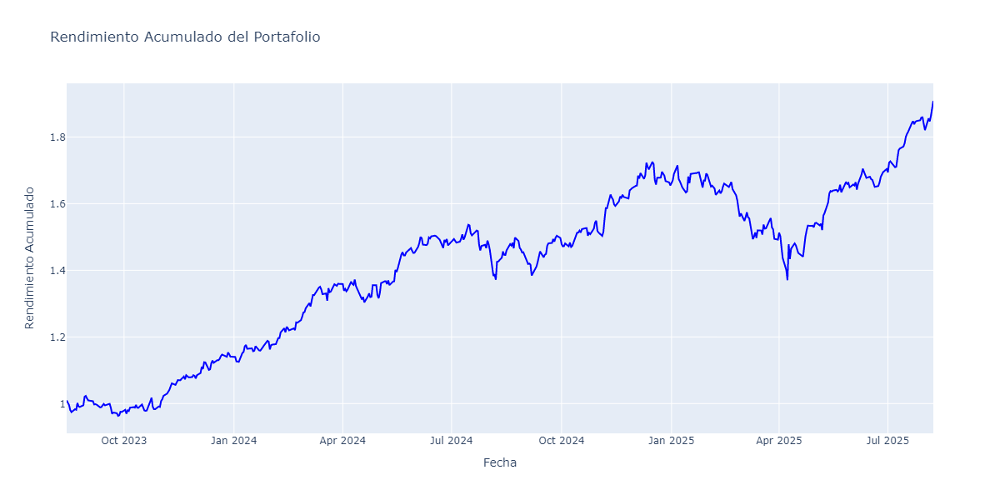
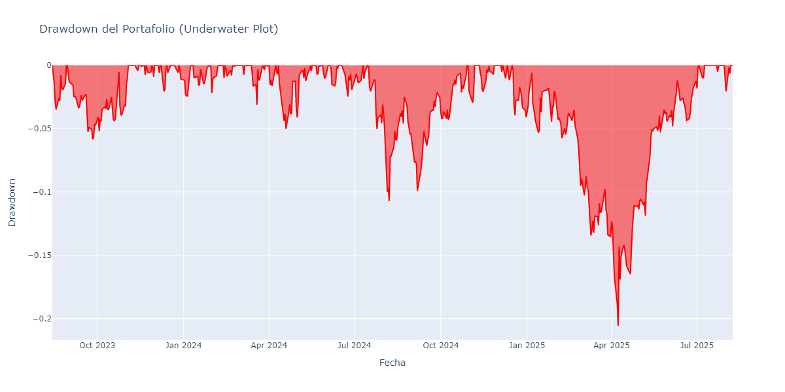
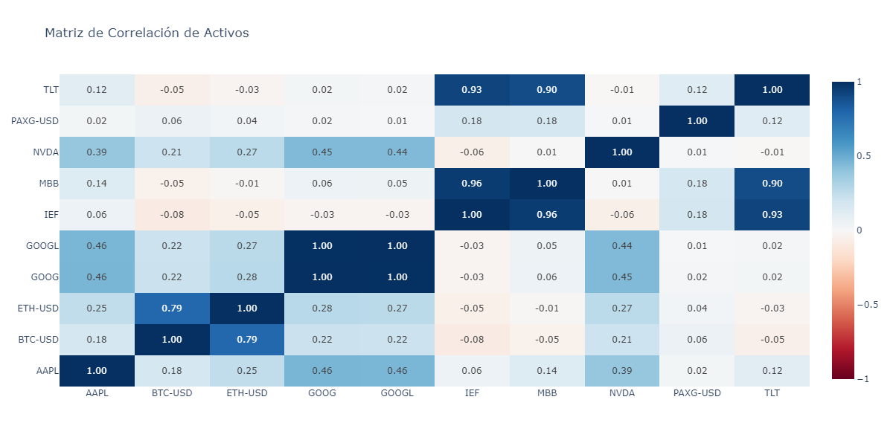

# Reporte de Análisis de Portafolio

**Fecha de generación:** 2025-08-11 17:25:31  
**Período analizado:** 2023-08-14 a 2025-08-08  
**Total de días:** 499

---

## 📊 Resumen Ejecutivo

### Composición del Portafolio
| Activo | Peso (%) |
|--------|----------|
| NVDA | 10.00% |
| GOOG | 10.00% |
| GOOGL | 10.00% |
| AAPL | 10.00% |
| TLT | 10.00% |
| IEF | 10.00% |
| MBB | 10.00% |
| BTC-USD | 10.00% |
| ETH-USD | 10.00% |
| PAXG-USD | 10.00% |

### 📈 Información Actual de Mercado
| Activo | Precio | Cambio ($) | Cambio (%) | Cap. Mercado | Sector |
|--------|--------|------------|------------|--------------|--------|
| NVDA | $182.06 | -$0.64 | -0.35% | $4.44T | Technology |
| GOOG | $201.63 | -$0.46 | -0.23% | $2.43T | Communication Services |
| GOOGL | $201.0 | -$0.42 | -0.21% | $2.43T | Communication Services |
| AAPL | $227.18 | -$2.17 | -0.95% | $3.37T | Technology |
| TLT | $87.39 | +$0.10 | +0.11% | $9.59B | None |
| IEF | $95.41 | +$0.03 | +0.03% | $13.93B | None |
| MBB | $93.56 | +$0.00 | +0.00% | N/A | None |
| BTC-USD | Error | - | - | - | - |
| ETH-USD | Error | - | - | - | - |
| PAXG-USD | Error | - | - | - | - |

### Métricas de Rendimiento Clave
| Métrica | Valor |
|---------|-------|
| Rendimiento Anualizado (%) | 38.60% |
| Volatilidad Anualizada (%) | 18.23% |
| Ratio de Sharpe | 1.77 |
| Ratio de Sortino | 2.78 |
| Ratio de Calmar | 1.88 |
| Máximo Drawdown (%) | -20.59% |
| Skewness (Asimetría) | 0.34 |
| Kurtosis (Curtosis) | 5.05 |
| Valor en Riesgo (VaR) Diario (%) | -1.75% |

---

## 🎯 Optimización de Portafolios

### Portafolio de Máximo Ratio de Sharpe
**Rendimiento Anualizado:** 51.73%  
**Volatilidad Anualizada:** 15.11%  
**Ratio de Sharpe:** 3.29

#### Composición Óptima (Máximo Sharpe)
| Activo | Peso Óptimo (%) |
|--------|-----------------|
| AAPL | 0.00% |
| BTC-USD | 13.79% |
| ETH-USD | 0.00% |
| GOOG | 0.00% |
| GOOGL | 0.00% |
| IEF | 14.13% |
| MBB | 0.00% |
| NVDA | 16.39% |
| PAXG-USD | 55.69% |
| TLT | 0.00% |

### Portafolio de Mínima Volatilidad
**Rendimiento Anualizado:** 10.60%  
**Volatilidad Anualizada:** 6.45%  
**Ratio de Sharpe:** 1.33

#### Composición Óptima (Mínima Volatilidad)
| Activo | Peso Óptimo (%) |
|--------|-----------------|
| AAPL | 0.57% |
| BTC-USD | 1.60% |
| ETH-USD | 0.00% |
| GOOG | 0.00% |
| GOOGL | 2.87% |
| IEF | 23.62% |
| MBB | 60.79% |
| NVDA | 0.51% |
| PAXG-USD | 10.05% |
| TLT | 0.00% |

---

## 📈 Análisis de Correlaciones

### Matriz de Correlación de Activos
| Activo | AAPL | BTC-USD | ETH-USD | GOOG | GOOGL | IEF | MBB | NVDA | PAXG-USD | TLT |
|--------|--------|--------|--------|--------|--------|--------|--------|--------|--------|--------|
| AAPL | 1.000 | 0.179 | 0.252 | 0.464 | 0.460 | 0.060 | 0.135 | 0.388 | 0.024 | 0.117 |
| BTC-USD | 0.179 | 1.000 | 0.789 | 0.218 | 0.216 | -0.083 | -0.045 | 0.212 | 0.064 | -0.055 |
| ETH-USD | 0.252 | 0.789 | 1.000 | 0.278 | 0.274 | -0.053 | -0.011 | 0.270 | 0.035 | -0.027 |
| GOOG | 0.464 | 0.218 | 0.278 | 1.000 | 0.998 | -0.025 | 0.057 | 0.446 | 0.018 | 0.025 |
| GOOGL | 0.460 | 0.216 | 0.274 | 0.998 | 1.000 | -0.028 | 0.054 | 0.444 | 0.013 | 0.023 |
| IEF | 0.060 | -0.083 | -0.053 | -0.025 | -0.028 | 1.000 | 0.957 | -0.059 | 0.183 | 0.927 |
| MBB | 0.135 | -0.045 | -0.011 | 0.057 | 0.054 | 0.957 | 1.000 | 0.006 | 0.180 | 0.897 |
| NVDA | 0.388 | 0.212 | 0.270 | 0.446 | 0.444 | -0.059 | 0.006 | 1.000 | 0.010 | -0.007 |
| PAXG-USD | 0.024 | 0.064 | 0.035 | 0.018 | 0.013 | 0.183 | 0.180 | 0.010 | 1.000 | 0.123 |
| TLT | 0.117 | -0.055 | -0.027 | 0.025 | 0.023 | 0.927 | 0.897 | -0.007 | 0.123 | 1.000 |

---

## 📊 Gráficos de Análisis

### Rendimiento Acumulado

### Análisis de Drawdown

### Matriz de Correlación (Heatmap)

---

## 🔍 Análisis Detallado

### Estadísticas de Riesgo
- **Valor en Riesgo (VaR) Diario:** -1.75%
- **Máximo Drawdown:** -20.59%
- **Skewness (Asimetría):** 0.34
- **Kurtosis (Curtosis):** 5.05

### Ratios de Rendimiento Ajustado por Riesgo
- **Ratio de Sharpe:** 1.77
- **Ratio de Sortino:** 2.78
- **Ratio de Calmar:** 1.88

---

## 💡 Conclusiones y Recomendaciones

### Análisis del Portafolio Actual
✅ **Excelente rendimiento ajustado por riesgo** - El ratio de Sharpe superior a 1.0 indica una buena compensación riesgo-rendimiento.

🚨 **Alto riesgo de pérdidas** - El máximo drawdown superior al 20% indica alta volatilidad y riesgo.

### Recomendaciones de Optimización
- **Para maximizar el ratio de Sharpe:** Considere ajustar los pesos según la composición óptima mostrada arriba.
- **Para minimizar riesgo:** La composición de mínima volatilidad puede ser más apropiada para perfiles conservadores.
- **Diversificación:** Analice las correlaciones para identificar oportunidades de mejor diversificación.

---

*Este reporte fue generado automáticamente el 2025-08-11 a las 17:25:36*
